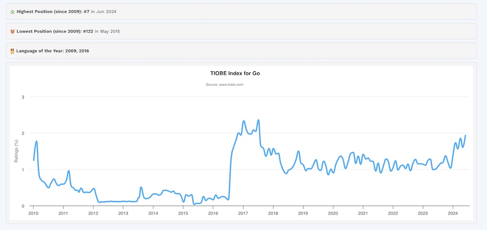

# Język GoLang dla programistów Python

## Od Autora:
Może język Golang nie dorównuje jeszcze popularnością Pythonowi czy Javascript, ale moim zdaniem jest to technologia, która najlepszy czas ma jeszcze przed sobą. Wg indeksu **TIOBE Golang** przesunął się w ciągu ostatniego roku z pozycji 13 na 7. Na pewno przyczynkiem do takiej pozycji jest zainteresowanie tym językiem tuzów Internetu oraz nadal rosnąca popularność usług chmurowych, a co za tym idzie technologii około DevOps'owych.

**Używanie niniejszego materiału w celach szkoleniowych jest dozwolone pod warunkiem podania źródła niniejszego repozytorium oraz imienia i nazwiska autora.**

#### Zapraszam do kontaktu w zakresie szkoleń Python lub Golang: <hello@it-mobile.net>

 **Miłej lektury !**

### Wprowadzenie
[1](01-dlaczego-go.md). **Dlaczego GoLang?**
   - Zalety GoLang w porównaniu do Pythona
   - Przykłady zastosowań GoLang

[2](02-podstawy-go.md). **Podstawy GoLang**
   - Historia i filozofia języka
   - Instalacja i konfiguracja środowiska

### Rozdział 1: Podstawy języka Go
[1](11-pierwszy-program.md). **Pierwszy program w Go**
   - Struktura programu
   - `package main` i `func main()`

[2](12-typy-danych.md). **Podstawowe typy danych**
   - Typy proste: int, float, string, bool
   - Typy złożone: arrays, slices, maps

[3](13-operatory-wyrazenia.md). **Operatory i wyrażenia**
   - Operatory arytmetyczne, logiczne i relacyjne
   - Tworzenie wyrażeń

[4](14-stdin-stdout.md). **Standardowe wejście i wyjście**
   - Odczyt wartości z klawiatury i ich walidacja
   - Wyświetlanie danych oraz ich formatowanie

[5](15-logowanie.md). **Logowanie**
   - Praktyki logowania w Go
   - Przegląd bibliotek

### Rozdział 2: Struktury kontrolne
[1](21-instrukcje-warunkowe.md). **Instrukcje warunkowe**
   - `if`, `else`, `switch`

[2](22-petle.md). **Pętle**
   - `for`
   - Pętle z warunkami i pętle nieskończone

[3](23-funkcje.md). **Funkcje**
   - Definiowanie i wywoływanie funkcji
   - Funkcje z wieloma wynikami
   - Funkcje anonimowe i zamknięcia

### Rozdział 3: Zaawansowane typy danych
[1](31-struktury.md). **Struktury**
   - Definiowanie struktur
   - Metody i odbiorniki

[2](32-interfejsy.md). **Interfejsy**
   - Definiowanie i implementacja interfejsów
   - Polimorfizm w Go

[3](33-channels-goroutine.md). **Kanały i gorutyny**
   - Wprowadzenie do gorutyn
   - Synchronizacja z kanałami

### Rozdział 4: Programowanie współbieżne
[1](41-prog-wspolbiezne1.md). **Wprowadzenie do współbieżności w Go**
   - Gorutyny i ich zarządzanie
   - Komunikacja za pomocą kanałów

[2](42-prog-wspolbiezne2.md). **Zaawansowane techniki współbieżności**
   - Buforowane vs. niebuforowane kanały
   - Select i timeouts

### Rozdział 5: Praca z plikami i sieciami
[1](51-obsluga-plikow.md). **Praca z systemem plików**
   - Otwieranie, czytanie i zapisywanie plików

[2](52-komunikacja-siec.md). **Programowanie sieciowe**
   - Tworzenie serwerów HTTP
   - Klient HTTP
   - Praca z gRPC

### Rozdział 6: Narzędzia i praktyki
[1](61-testowanie.md). **Testowanie**
   - Pisanie testów jednostkowych
   - Używanie pakietu `testing`

[2](62-debugowanie.md). **Debugowanie**
   - Używanie `delve`
   - Diagnostyka i profilowanie

[3](63-moduly.md). **Moduły i pakiety**
   - Organizacja kodu w Go
   - Tworzenie i zarządzanie modułami

[4](64-wyjatki.md). **Wyjątki**
   - Typ error
   - Panic i Recover

### Rozdział 7: Migracja z Pythona na Go
[1](71-skladnia.md). **Porównanie składni**
   - Typowe wzorce i różnice

[2](72-przeksztalcenie.md). **Przekształcanie skryptów Python do Go**
   - Przykłady migracji kodu

[3](73-zaleznosci.md). **Zarządzanie zależnościami**
   - Używanie `pip` vs. `go modules`

### Rozdział 8: Przykładowe projekty
[1](81-aplikacja-cli.md). **Aplikacja CLI**
   - Tworzenie narzędzia wiersza poleceń

[2](82-aplikacja-web.md). **Aplikacja Webowa**
   - Prosty serwer webowy

[3](83-aplikacja-bazadanych.md). **Aplikacja bazodanowa**
   - Integracja z bazą danych

[4](84-mikroserwisy.md). **System rozproszony**
   - Implementacja mikroserwisów w Go

### Załączniki
[1](91-zasoby.md). **Zasoby dodatkowe**
   - Dokumentacja, blogi i książki

[2](92-biblioteki.md). **Narzędzia i biblioteki**
   - Przegląd przydatnych narzędzi i bibliotek w ekosystemie Go

[3](93-cwiczenia.md). **Ćwiczenia i quizy**
   - Zadania praktyczne do samodzielnego rozwiązania

---
© 2024 Marian Witkowski marian.witkowski[at]gmail.com
